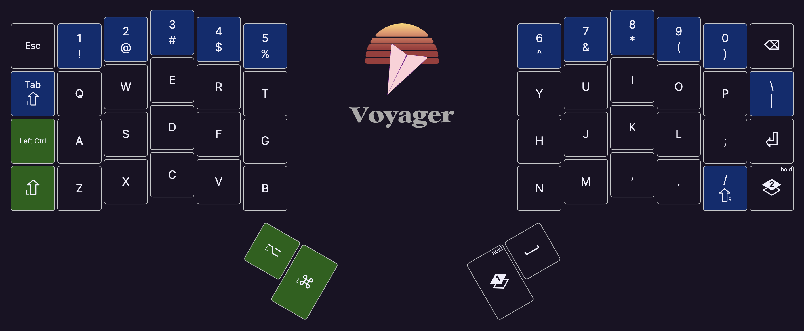
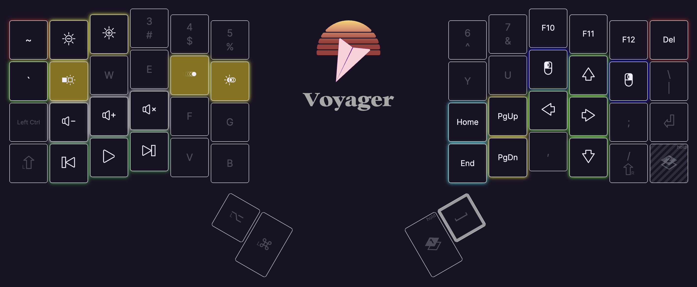

# voyager-keymap

HHKB style of arrow keys for Voyager.

If you interested in another custom hhkb keyboard, please see [tokyo60-keymap](https://github.com/channprj/tokyo60-keymap).

## Reference

- [ZSA Voyager](https://www.zsa.io/voyager/)
- [QMK - Getting started](https://docs.qmk.fm/#/newbs_getting_started?id=set-up-your-environment)
- [ZSA Configure](https://configure.zsa.io/voyager/layouts/VGQwX/latest/0)
